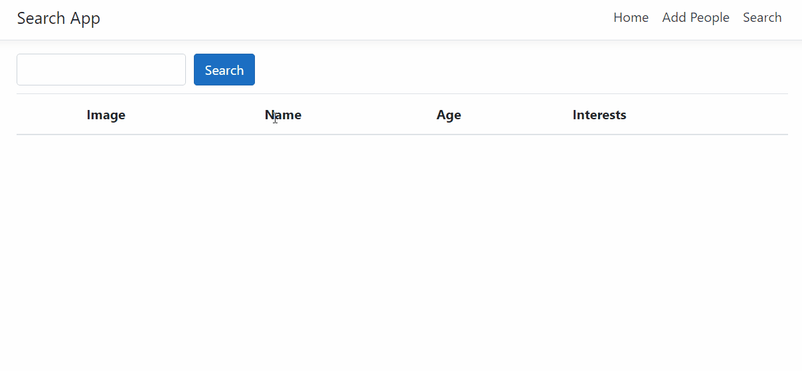

# People Search App

This solution was created for Health Catalyst's technical assessment for applicant developers. This app allows users to submit and search for user profiles in a database using a WebAPI built on .NET Entity Framework and a UI comprised of React.js components. 

To try the project for yourself you'll only need the following:

A recent version of Node.js

Visual Studio

Once you have download the solution, you can see and run the app by simply opening the .sln file and allowing Visual Studio to install the needed dependencies.

# Demonstrations

